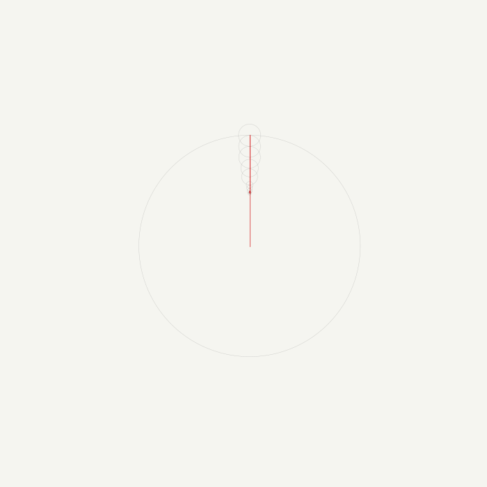
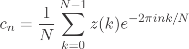
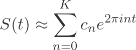

# **Fourier Series: 2D Image Reconstruction**

## **About**
This project is a simple demonstration of the Fourier Series applied to 2D image reconstruction.
It parses an SVG file, computes the coeficents of the Fourier Series of the resulting complex signal and animates using Matplotlib.



---

## **Installation**

Clone the repository and set up a virtual environment:

```bash
git clone https://github.com/mateusmd-git/sandbox.fourier-series.git
cd sandbox.fourier-series

python -m venv .venv
source .venv/bin/activate   # For Windows, use '.venv\Scripts\activate' instead

pip install --upgrade pip
pip install .               # installs numpy, matplotlib, svgpathtools and typer
```

## **Usage**

Simply type:

```bash
fourier --source <SVG-FILE-PATH>
```

For all available options:

```bash
fourier --help
```

---

# **How it Works**

First, the input SVG is sampled into *N* evenly spaced points. Each point
`(x, y)` is then encoded as a complex number:

```
z[k] = x[k] + i·y[k],   k = 0, 1, …, N−1
```

This collapses a 2D curve into a single complex-valued sequence, which is
exactly the form required by the Fourier Series.

We used the Discrete Fourier Transform (DFT) to decomposes the signal into a
sum of rotating phasors.
For each frequency index *n*, the complex coefficient is:



Then, at any normalized time `t ∈ [0, 1)`, the reconstructed position is the
sum of all retained phasors:


